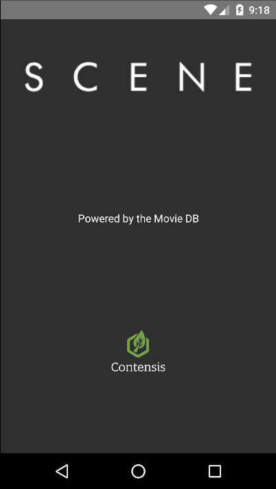
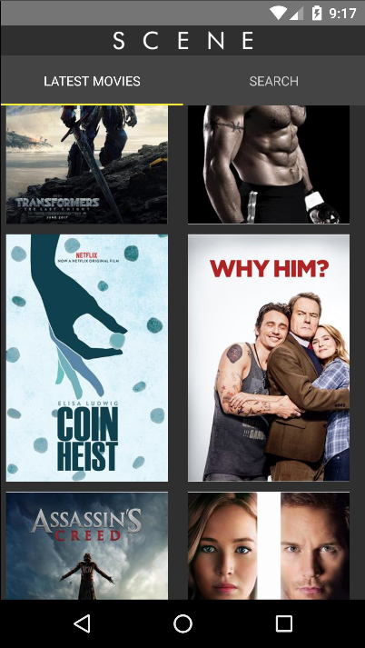
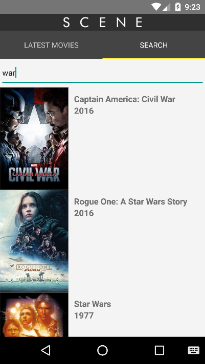
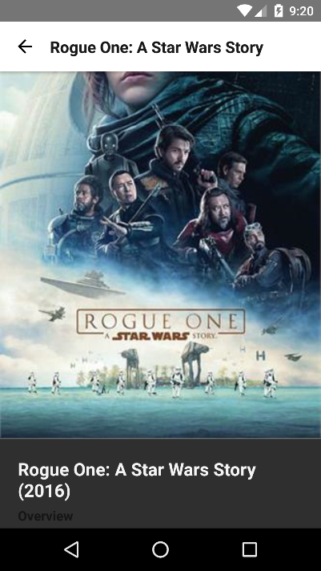

# Scene Mobile Demo

A react-native mobile app demo for Android using the Contensis Delivery API.

## Screenshots

    

        
        
Welcome

    

    

        
        
Latest movies

    

    

        
        
Latest movies

    

    

         
        
Movie record

    

## Prerequisites

To set up your development environment and install the required prerequisites follow the instructions on the [React Native website](https://facebook.github.io/react-native/docs/getting-started.html). 

## Installation
Clone the repository and the within the root directory run the following:

**npm install**

## Running the Application
Launch your Android Emulator then run the following command:

**react-native run-android**

## Documentation

To learn more about React Native visit the [React Native website](https://facebook.github.io/react-native/)

Read our [documentation on the Contensis Javascript Delivery API](https://developer.zengenti.com/contensis/api/delivery/js/) to learn of all it's features.